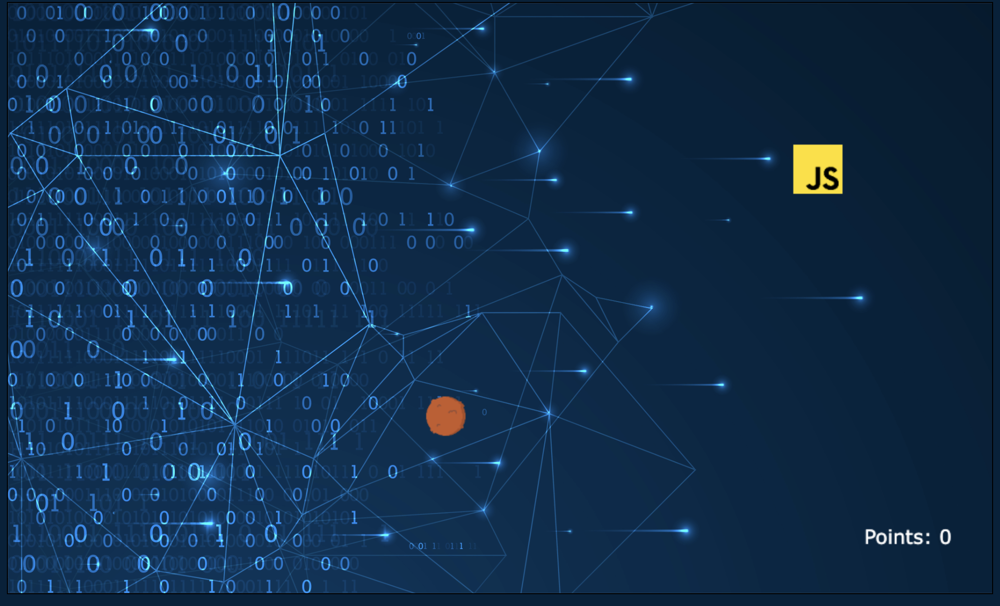

# Meatball game

> This game is for my students at Ironhack, so that they have an example of the game they should do for module 1.

## Description

In this game the player is a meatball developer, that grows when it eats useful stuff and shrinks when it eats unwanted items.

The purpose of the game is to score points (which one can do endlessly). The game ends when the user is below 0 points.

## User stories MVP

- User can hit play button and see the game screen
- User can move right and left
- User can increase when it collides with food
- User can decrease when it collides with poison
- User can see the scoring board on screen
- User can see a game over page when they lose

## User stories Backlog

- User can level up

## File structure

- <code>player.js</code>: constructor for the player meatball. Methods: moveRight(), moveLeft(), \_increase(), \_decrease()
- <code>droplet.js</code>: constructor for the falling items. Methods: \_fallDown(), \_assignRole(), \_assignImage()
- <code>assets.js</code>: contains the images and resources for the game
- <code>game.js</code>: contains all the elements for the game to work. Methods: ...

## Useful links

- [Presentation slides]()
- [Deployed game](https://alebausa.github.io/meatball-dev/)
